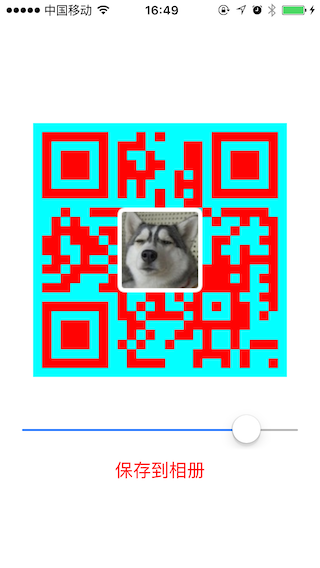

# QRCode

## Usage

```
 _imageView.image = ({
    
        QRCode *qrcode = [[QRCode alloc] init];
        qrcode.dataString = @"www.baidu.com";
        qrcode.size = _imageView.bounds.size;
        qrcode.errorCorrection = ErrorCorrectionHigh;
        qrcode.frontColor = [UIColor redColor];
        qrcode.backgroudColor = [UIColor cyanColor];
        qrcode.iconImage  = [UIImage imageNamed:@"dog.jpg"];
        qrcode.iconRadius = 8;
        qrcode.iconBorderWidth = 10;
        qrcode.iconBorderColor = [UIColor whiteColor];
        [qrcode qrImage];
    
    });


```
##ScreenShot


